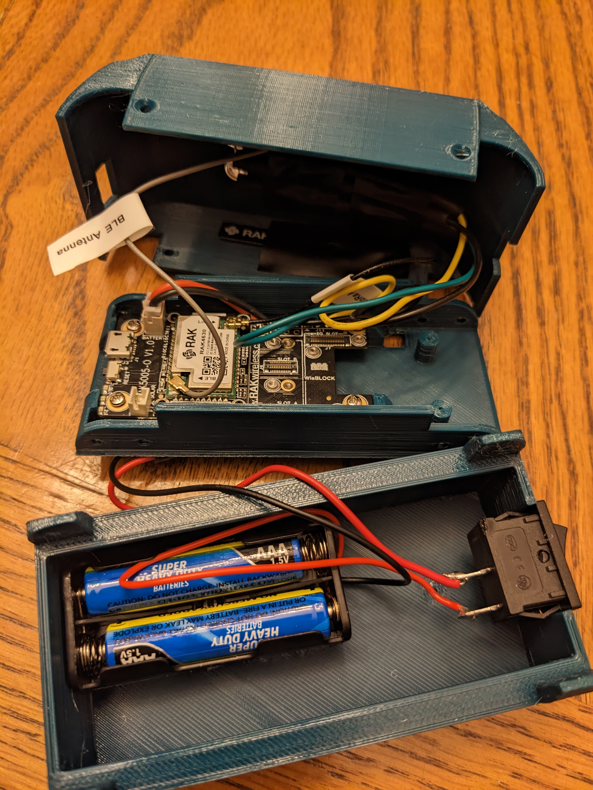

# Helium LoRa Detector
Docs 2-21-23 V1 (For questions or comments:  Stephen Witty switty@level500.com)  

### Project Overview:
The Helium LoRa Detector determines Helium LoRa coverage and reliability.  It can be used to determine if Helium LoRa is available in a given area and also network uptime if left running at a given location.  The project is designed to run on batteries allowing for a portable solution.  The project is designed to provide Helium status via two external LEDs or by evaluating the built-in RAK4631 status LED.  The project can run for 2 months on two AAA batteries.

### Many thanks:

- The Mycelium Networks Builder Program for support and encouragement
- RAK Wisblock for excellent hardware offerings and code examples

 &nbsp; &nbsp;  &nbsp; &nbsp; &nbsp; &nbsp; &nbsp; &nbsp; &nbsp; &nbsp;

### Hardware:
- RAK4631 - MCU
- RAK5005-O - Baseboard
- Two LEDs and two 1K resistors (optional LEDs for case)
- External battery pack (for instance two AAA batteries) (optional)

### Project files:
- Documentation - ReadMe.md
- Primary Source Code - Helium_LoRa_Detector.ino (Aurdrino sketch)
- Header file - keys.h (Contains Helium user application keys)
- DataCake decoder file - DataCake decoder.txt
- Case 3D model - WisBlock-Simple-Lab-Carrier-XXXXX (Based on WisBlock example)

### Circuit:
- Green LED - connected to WB_IO1 with 1K resistor to ground (optional part)
- White LED - connected to WB_IO2 with 1K resistor to ground (optional part)
- Power can be provided via USB port or RAK5005-O LiPo battery port

### Operation:
When powered on, the device attempts to connect to Helium LoRa.  Status is provided via LEDs and documented below.  If a successful LoRa connection is made, stats are then transmitted to a backend via LoRa.  If left powered on, the device repeats this operation every 3 minutes.  The device keeps track of the number of successful / failed LoRa connections and the time to connect to LoRa.  The device can be left running to gather network uptime stats or turned on and off as needed to determine LoRa availability at a given location or time.

### LED meaning:
- Green (IO1) Blinking - attempting LoRa connection,  Off - MCU booting or LoRa not available, On - LoRa connection successful
- White (IO2)		On - LoRa connection failed
- Built-in Green LED - Same as Green LED (IO1) above

### Misc:
- Stats are kept persistently on the MCU flash storage.  These continue to increment until reaching some large maximum number at which time they are reset to zero.
- The MCU is reset via a watchdog routine.
- The user must insert their own Helium LoRa keys in keys.h
